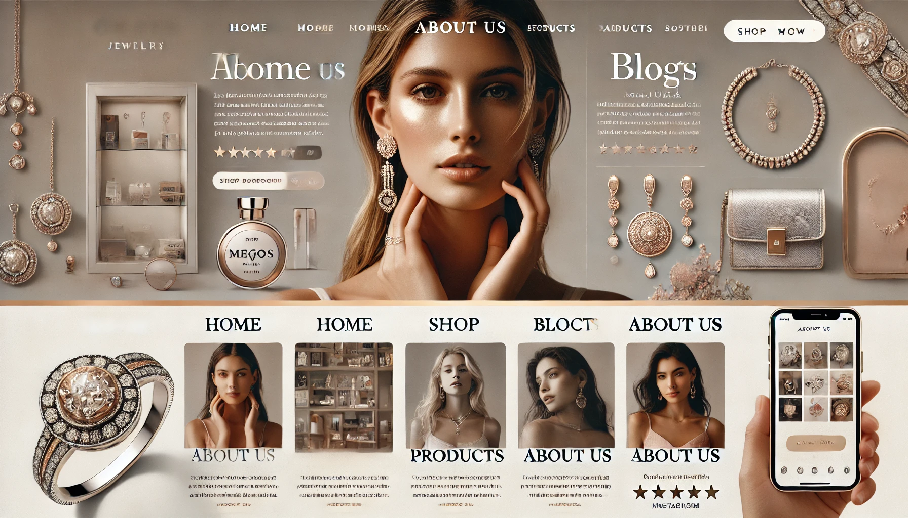

# Joyería Website Lumina 💎✨

Una elegante plataforma web para una joyería fina, diseñada para destacar colecciones exclusivas de anillos, collares, pulseras y accesorios de lujo.

---

## 🌟 Características Principales

- **Diseño Moderno & Elegante:** Interfaz limpia con paleta de colores sofisticada e imágenes de alta calidad.
- **Catálogo de Productos:** Exhibición de piezas destacadas con descripciones y precios.
- **Diseño Responsive:** Adaptable a dispositivos móviles, tablets y escritorios.
- **Sección de Ofertas & Destacados:** Promociones y novedades para los clientes.

---

## Vista Principal

---

## 🚀 Tecnologías Utilizadas

- **HTML5:** Estructura semántica.
- **CSS3:** Estilos personalizados, layout responsive y animaciones.
- **JavaScript:** Interactividad dinámica.

---

